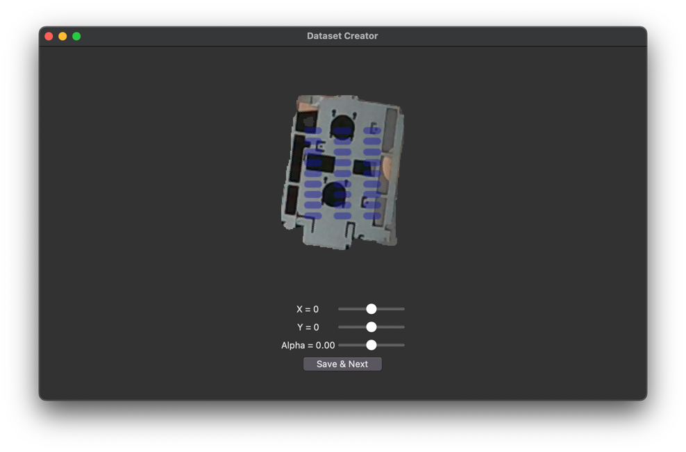

# ProKI Hackathon 2024: Data Preparation for AI Training

This project is part of **Hackathon 2024**, organized by ProKI in collaboration with ARKU, KIT, and TU Darmstadt. The focus is on preparing high-quality datasets for training AI models to solve real-world manufacturing problems.

## Objective
To prepare datasets that:
- Are optimized for training AI to analyze images of sheet metal parts.
- Enable accurate and robust positioning of a robotic gripper for handling.

## Context
The datasets generated in this project will help train AI models to support manufacturing processes, such as robotic handling and straightening of sheet metal parts.

## Technologies
- Image preprocessing and augmentation.
- Dataset labeling and validation for machine learning.

## Features
- Gripper overlay with adjustable parameters (X, Y, rotation angle).
- Dataset creation for machine learning.

## Note
This repository focuses on dataset preparation as a precursor to AI model training and was developed for a hackathon competition.